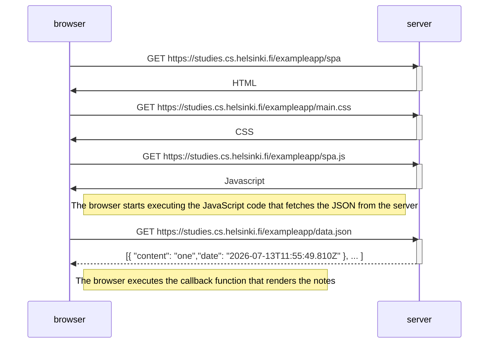

```mermaid
sequenceDiagram
    participant browser
    participant server
 browser->>server: GET https://studies.cs.helsinki.fi/exampleapp/spa


 activate server
    server->>browser: HTML
deactivate server

browser->>server: GET https://studies.cs.helsinki.fi/exampleapp/main.css

 activate server
    server->>browser: CSS
deactivate server

browser->>server: GET https://studies.cs.helsinki.fi/exampleapp/spa.js

 activate server
    server->>browser: Javascript
deactivate server

Note right of browser: The browser starts executing the JavaScript code that fetches the JSON from the server

browser->>server: GET https://studies.cs.helsinki.fi/exampleapp/data.json


 activate server
    server-->>browser: [{  "content": "one","date": "2026-07-13T11:55:49.810Z" }, ... ]
    deactivate server

    Note right of browser: The browser executes the callback function that renders the notes


```
