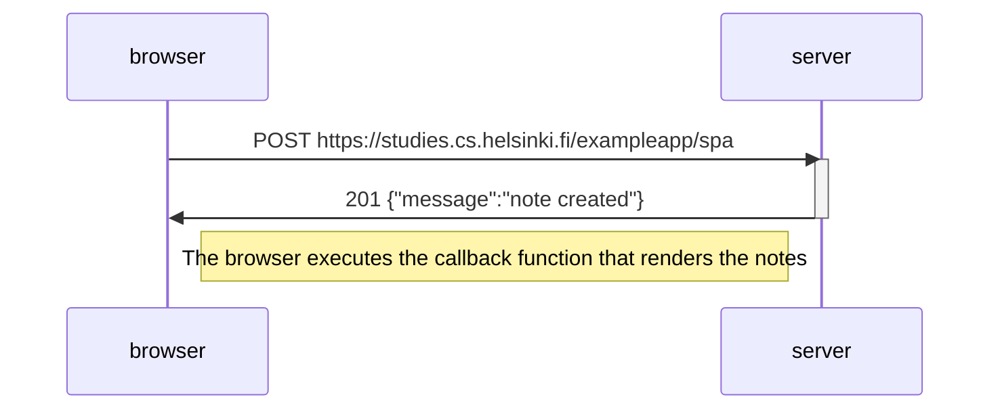

```mermaid
sequenceDiagram
    participant browser
    participant server
 browser->>server: POST https://studies.cs.helsinki.fi/exampleapp/spa


 activate server
    server->>browser: 201 {"message":"note created"}
deactivate server
Note right of browser: The browser executes the callback function that renders the notes

```
